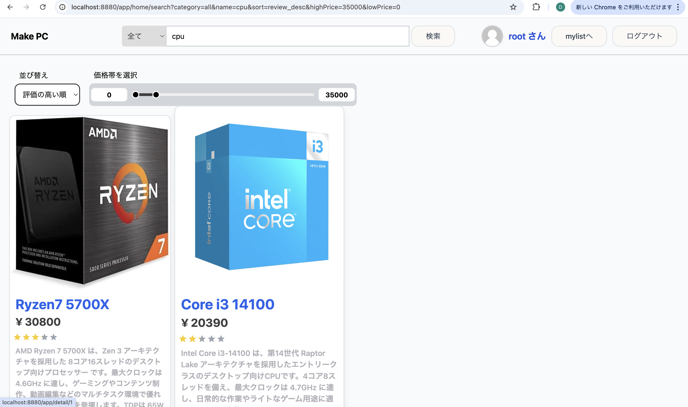
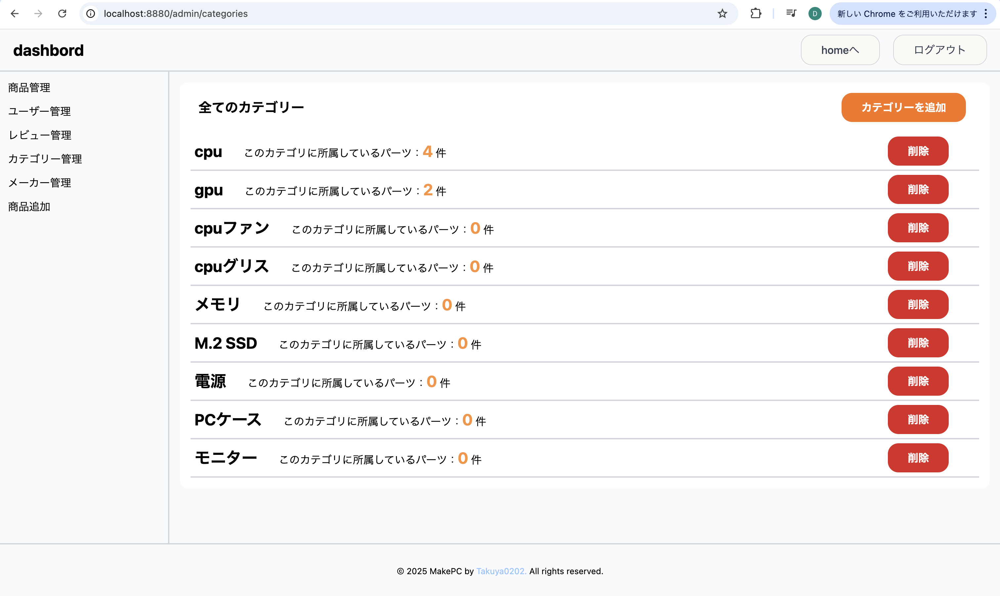

# make_pc
<br>
<p align="center">
    
</p>
<br>

## make_pcについて
make_pcは自作pcを作る手助けをするサービスです<br>


### 主な機能
- ✅ ユーザー認証
- ℹ️ パーツの情報 
- 💬 レビュー機能
- 📌 パーツをリストに追加する機能 
- 🛠️ 管理者ページ

## 技術スタック
</img>
</img>
</img>
</img>

## セットアップ方法
まずは以下を実行<br>
```bash
git clone https://github.com/Takuya0202/make_pc.git
cp .env.docker .env
cd app
cp .env.example .env
```
上を実行後 `.env` ファイルに管理者情報、データベース情報を記載<br>

`.env` に記載後、再び以下を実行<br>

```bash
docker-compose build
docker-compose run back bash
composer install
php artisan key:generate
php artisan config:clear
php artisan config:cache
php artisan migrate --seed
mkdir -p storage/framework/cache storage/framework/sessions storage/framework/views bootstrap/cache
php artisan storage:link
```
その後、http://localhost:8880 にアクセス<br>

## アプリ画面 
### ユーザー認証画面 
<p float="left">
    </img>
    </img>
</p>

ユーザー認証に成功すると、http://localhost:8880/app/home にリダイレクトされます<br>

ユーザーはアイコン、ユーザー名、email、passwordを決めることができ、予めseederで5人のユーザーと1人の管理者ユーザーが設定されています<br>

### パーツページ
#### 一覧ページ
<p float="left">
    </img>
    </img>
</p>
ここではパーツの一覧ビュー、絞り込み機能があり、予めseederで6件のパーツがセットされます<br>

##### 詳細ページ
<p float="left">
    </img>
    </img>
</p>
パーツ詳細情報ではユーザーレビューや商品のリンク、リスト追加機能などがあります<br>

### レビューページ
<p float="left">
    </img>
    </img>
</p>
ユーザーは5段階評価とパーツについてのレビューが記載できます。予めseederで各パーツに3件のレビューがセットされます<br>

### ユーザープロフィール 
<p float="left">
    </img>
    </img>
</p>
ユーザープロフィールではアイコン、ユーザー名、emailが変更できます。<br>

### listページ 
<p float="left">
    </img>
    </img>
</p>
リストページではユーザーが追加した商品と合計金額を見ることができます。各ユーザーは5つのリストを持っています<br>

## 管理者画面
### ダッシュボード
</img>
管理者ユーザーは http://localhost:8880/admin にログインすることができます。<br>
統計や直近に追加されたレビューやパーツが見れます<br>

### パーツ管理 / 
#### 一覧ページ /
<p float="left">
    </img>
    </img>
</p>
パーツ管理ページでも同様に検索機能、並び替え機能があります<br>

#### 追加ページ 
<p float="left">
    </img>
    </img>
</p>
パーツ情報を入力後、作成すると以下のように追加できます<br>
カテゴリーやメーカーは新しく作成もできます。<br>
作成すると以下のように登録されます<br>
<p float="left">
    </img>
    </img>
</p>

#### 詳細ページ
<p float="left">
    </img>
    </img>
</p>

#### 編集・削除ページ
<p float="left">
    </img>
    </img>
</p>
登録したパーツの情報更新、削除ができます<br>

### レビュー管理
#### 一覧ページ 
<p float="left">
    </img>
    </img>
</p>

#### 特定のユーザー,パーツのレビュー
<p float="left">
    </img>
    </img>
</p>
特定のユーザーやパーツについてのレビューも見ることができます。<br>

#### レビューの詳細情報 / 
<p float="left">
    </img>
    </img>
</p>
レビューの本文をクリックすることでレビューの詳細情報を見ることができます<br>

### ユーザー管理
<p float="left">
    </img>
    </img>
</p>
ユーザーの名前や管理者権限を持っているもののみなど検索、絞り込みができます<br>


### カテゴリー管理 
<p float="left">
    </img>
    </img>
</p>
パーツが所属しているカテゴリーの件数、作成、削除ができます。<br>

### メーカー管理 
<p float="left">
    </img>
    </img>
</p>
カテゴリー同様、所属しているパーツの件数、作成、削除が行えます<br>

## 開発者 
<a href="https://github.com/Takuya0202">Takuya0202 (Design & Programing)</a>

## 開発に至って 
3月からlaravelに関して本格的に学び、そのアウトプットとして自作pcを作るサイトを作りました。<br>
今回のアプリケーションでは自作pcを作ること以外にも、seeder,factoryの利用や多対多のリレーションやコンポーネントの利用、ミドルウェアなど学んだ知識を活用して開発に取り掛かりました<br>
bladeのみで作っているのでwebアプリケーションとしての完成度はまだまだですが、価格帯の検索バーやレビューの星評価などdom操作を用いたjsも少し使ってこだわってみました<br>
今後はフロントエンドを学習してapiとしてlaravelを利用したり、デプロイについても学習していきたいです!<br>
価格帯のレンジバーについてはまとめてあるのでみてくださると嬉しいです<br>
https://zenn.dev/amethyst/articles/52b06dd5ee69ab
